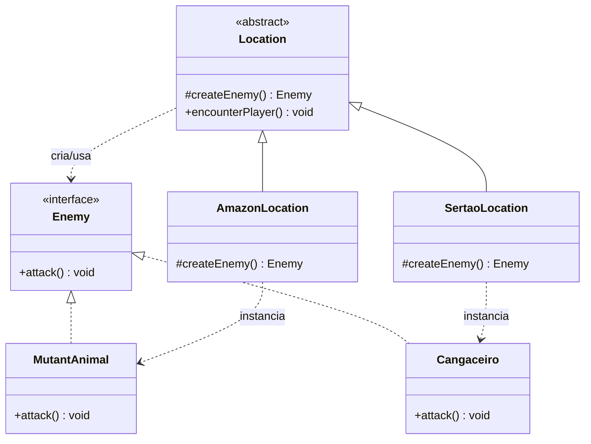

# Diagrama de Classes — Factory Method

## Papéis no padrão

- **Product:** `Enemy`
- **Concrete Products:** `MutantAnimal` e `Cangaceiro`
- **Creator:** `Location`
- **Factory Method:** `createEnemy()`
- **Concrete Creators:** `AmazonLocation` e `SertaoLocation`

A classe `Location` controla o fluxo do confronto, mas não instancia diretamente um inimigo concreto. Cada subclasse escolhe o produto adequado sobrescrevendo `createEnemy()`.

Para adicionar futuramente o Rio de Janeiro, basta criar um novo `Enemy` (por exemplo, o inimigo da fase) e uma nova subclasse de `Location`; o fluxo `encounterPlayer()` permanece inalterado.
